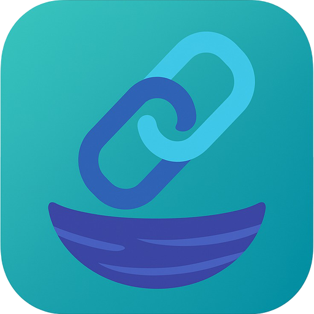

# LinkNest

### Smart Link Saver for Android

---

## 📱 Screenshots

---

## ✨ Overview

**LinkNest** is a modern Android app built with Flutter that allows users to effortlessly save, manage, and revisit links shared from any app — be it browsers, social media (Reddit, Facebook, Instagram, YouTube), or messaging platforms.

Designed with **Material 3** UI and a **mobile-first approach**, LinkNest is clean, convenient, and user-focused.

---

## 🌟 Features

- 📥 **Universal Link Sharing Support**  
  Share links directly from any app via Android's native share sheet.

- ➕ **Manual Link Addition**  
  Add links manually with a single tap on the "+" icon.

- 🧠 **Smart Folder Sorting**  
  Links are automatically categorized into folders based on their domain name with custom icons/logos.

- 📝 **Editable Notes**  
  Add and edit notes for each saved link to personalize or remember context.

- 🔁 **Grid & List Views**  
  Switch between a detailed list view or a sleek grid layout.

- ☁️ **Data Backup & Restore**  
  Easily back up your data or restore it on a new device.

- 🆕 **Version & Update Page**  
  Dedicated section for changelog, bug fixes, and updates.

- 🎨 **Material You Theme**  
  Supports dynamic theming for a seamless look on Android 12+.

---

## 🧪 How It Works

1. Share a link from any app (browser, Reddit, YouTube, etc.) to **LinkNest**.
2. The app auto-saves it with metadata and groups it smartly.
3. Optionally, add notes or move it to a custom folder.
4. View all saved links in a list or grid.
5. Tap any link to open in the browser or native app.

---

## 🛠 Tech Stack

- **Flutter**
- **Dart**
- **Material 3 (Material You)**
- **Shared Preferences / SQLite**
- **Mobile-First Responsive UI**

---

## ⬇️ Download

The latest builds are available on:

- [GitHub Releases](https://github.com/DevSon1024/LinkNest/releases)
- [F-Droid](#) (Coming soon)
- [Play Store](#) (Coming soon)

---

## 💬 Feedback & Community

Have suggestions, bugs, or ideas?  
Join the discussion open an [issue](https://github.com/DevSon1024/LinkNest/issues) on GitHub.

---

## 📖 Changelog

You can find the full changelog in [CHANGELOG.md](https://github.com/DevSon1024/LinkNest/blob/main/CHANGELOG.md)

---

## 🙌 Acknowledgements

LinkNest was inspired by the idea of combining productivity with simplicity.  
Thanks to the Flutter and Material communities for their fantastic open-source tools.

---

## 📄 License

This project is licensed under the [MIT License](LICENSE).

---

[↑ Back to Top](#linknest)

